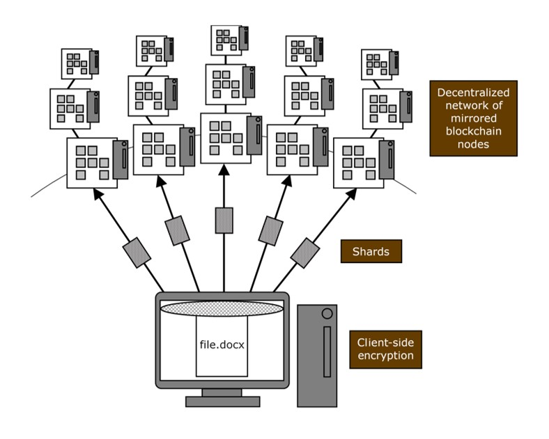
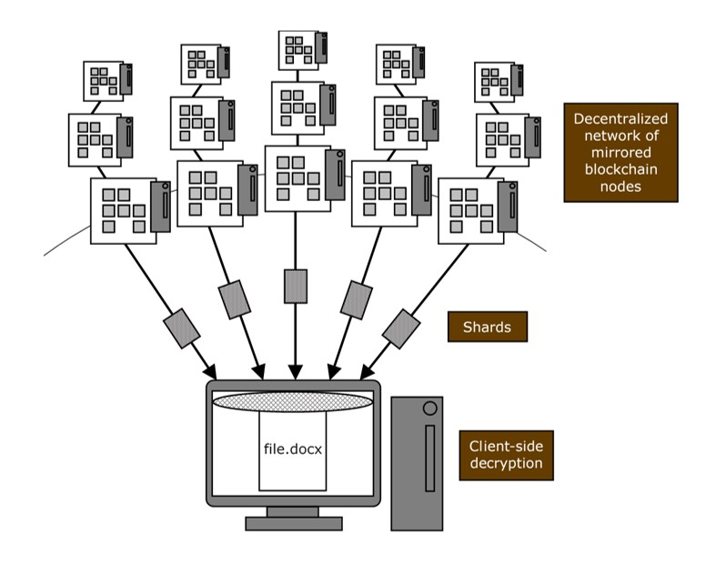

# Understanding blockchain-based, decentralized cloud storage

Blockchain, an increasingly popular technology that can be used in a range of industries, is essentially a decentralized peer-to-peer system that's connected to create complete sets of data. These nodes reside on servers that run on various operating systems and computers of varying levels of power. Aside from verifying transactions for cryptocurrencies such as Bitcoin and Ethereum, an increasingly popular use for blockchain technology is as a decentralized cloud storage solution.

<!-- truncate -->

:::note

I originally published the following post on a self-hosted Wordpress site that subsequently crashed after years of service. To consolidate my written knowledge during those various times, I am republishing my old posts as is. Apologies in advance if any content in this post is incorrect or outdated.

:::

## Centralized versus decentralized storage

In a traditional, centralized cloud storage architecture, a file is uploaded to a server (likely redundant servers in most cases) and stored in a database. The issue with this is security. If a cloud storage account is compromised through phishing or other types of account hijacking, a hacker would have access to the account and files uploaded to the server.

In a blockchain-based, decentralized cloud storage architecture, a file is uploaded to an ecosystem of servers that host the blockchain and its nodes, which are essentially databases. A node stores only a fraction of the encrypted data, known as a shard, that makes up the file, and therefore, no single node contains a complete file. However, in a process called "mirroring," multiple servers store the same shard, which ensures high availability for the file uploaded. For example, if a server storing a shard within the blockchain goes down, another node within the blockchain network will automatically activate its mirrored shard.

The following diagram shows the process of uploading a file in a decentralized cloud storage architecture:

The following diagram shows the process of downloading a file in a decentralized cloud storage architecture:

## Considerations

Currently, one of the primary drawbacks when using a blockchain-based, decentralized cloud storage architecture is speed. Retrieving data from a standard cloud storage server is fast because of the direct, and thus speedy, connection to the server and a single location where the file is stored.

However, in a decentralized cloud storage architecture, users need to connect to the blockchain-based ecosystem to retrieve data from disparate nodes. These nodes are located on servers in various locations with varying connection speeds and processing power. This is fine for uploading and downloading small files to and from a decentralized cloud storage architecture, but the bottleneck occurs when using large files.
