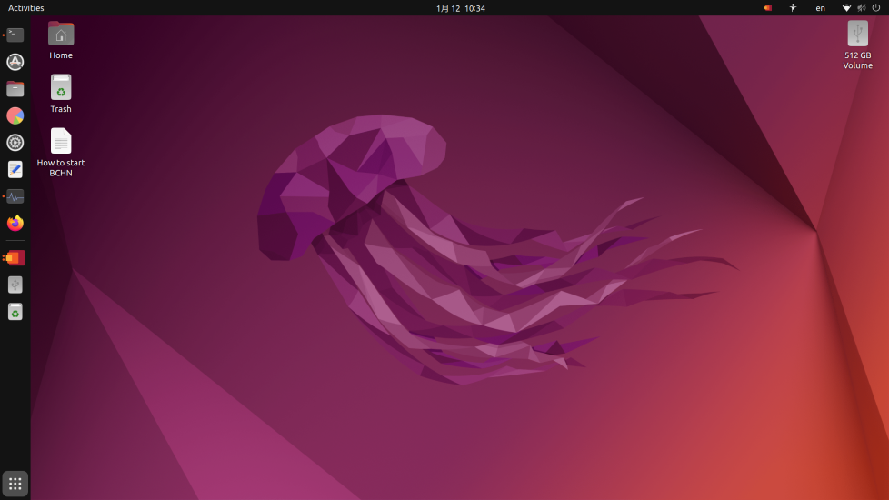
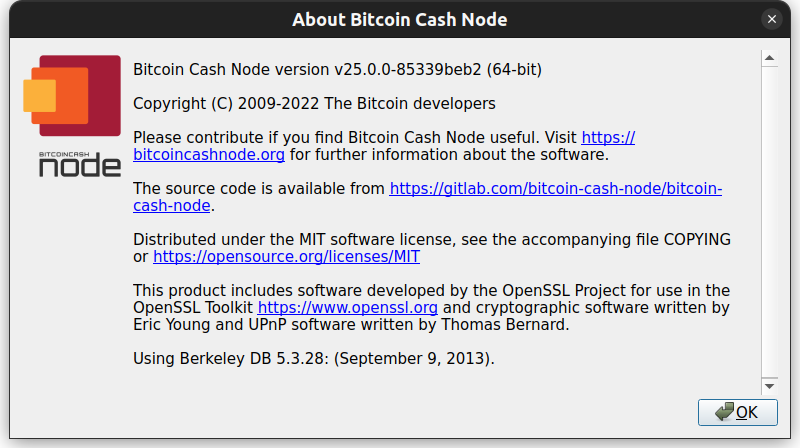

# Resurrecting my Raspberry Pi 4

In October 2022, the fan on my Raspberry Pi 4 started making a loud clicking noise, so I unplugged the device and promptly forgot about it since I was busy. Since I didn’t have plans on my first day off for the 2023 New Year holiday break, I decided to get my Raspberry Pi 4 running again.

<!-- truncate -->

Previously, my Raspberry Pi 4 was primarily used to run Bitcoin Cash Node, which is software that helps power the Bitcoin Cash blockchain network and its transactions. I wanted to get back to contributing to the health of Bitcoin Cash and eventually use the device to run some other Linux-only programs.

The following is what I did to get my Raspberry Pi 4 running again and some of the programs I've set it up to run.

## Removed the problematic fan

The easy solution was to simply unplug the fan from the GPIO pins and remove it from the case. Now I just hope the heat sinks are enough to keep the device cool. So far, so good!

At some point, I'll dig out a spare fan from my box of miscellaneous gadgets.

## Upgraded Ubuntu to 22.04.1 LTS (Jammy Jellyfish)

Next up on the to-do list: check for an operating system upgrade.

When I booted up my Raspberry Pi 4 and tried updating Ubuntu, I was greeted with an error message that my version of Ubuntu, v21.10 (Impish Indri), was no longer eligible for updates. To get around this issue, I followed the troubleshooting workaround at [EOLUpgrades | Ubuntu Documentation](https://help.ubuntu.com/community/EOLUpgrades) to enable upgrading to a newer version of Ubuntu.

After modifying the `sources.list` file as stated in the instructions, I ran the update and upgrade commands in Terminal. The workaround worked, and I was able to upgrade Ubuntu from 21.10 (Impish Indri) to Ubuntu 22.04.1 LTS (Jammy Jellyfish) on my Raspberry Pi 4.

No noticeable surprises with this upgrade since I’m not an Ubuntu power user. The squid background is pretty cool though.

***Ubuntu 22.04 (Jammy Jellyfish) squid background***

## Started running a Bitcoin Cash Node again

After getting my Raspberry Pi 4 running again, I also decided to operate a Bitcoin Cash Node again.

:::note

I'm simply operating a Bitcoin Cash Node to contribute to the Bitcoin Cash network. Since I'm not mining Bitcoin Cash, I don't receive mining rewards. My reward is supporting Bitcoin Cash as a way to create sound money that is usable by everyone in the world.

:::

On the Bitcoin Cash Node site, I saw that an [upgrade to the Bitcoin Cash network would occur on May 15, 2023](https://bitcoincashnode.org/en/newsroom/announcing-bitcoin-cash-node-v25-0-0). To continue contributing to the health of the network after that date, I would need to upgrade the node software from v24.0.0 to v25.0.0.

***Bitcoin Cash Node "About" window showing v25.0.0***

When upgrading the Bitcoin Cash Node software to v25.0.0, I referred to the tutorial that I’d created when I upgraded from v23.0.0 to v24.0.0. The instructions worked as expected, and I was able to improve the documentation by adding some knowledge that I’d gained while performing this upgrade.

You can see the tutorial I created for upgrading a Bitcoin Cash Node on Ubuntu at [How to upgrade Bitcoin Cash Node on a Raspberry Pi 4 running Ubuntu Desktop](https://www.080F53.com/bitcoin-cash-node-on-raspberry-pi/upgrade/).

:::note

Use Signal for messaging? Check out the [Why Bitcoin Cash? sticker pack](https://signal.art/addstickers/#pack_id=183a3ca8d7ccdcdb8fa7728b17453fbc&pack_key=e9ac42b0e7276edd92d293321d2e51cca64e5744bad567fd9579b51abb78773d)! I created this sticker pack based on the "Why Bitcoin Cash?" brand assets.

:::

## Installed Foremost for recovering data from drives

After confirming that my Bitcoin Cash Node was running, I wanted to check off another item that’s been on my to-do list for a while: recover data by using Foremost, a popular data recovery tool.

At first, I tried installing Foremost in a Windows Subsystem for Linux (WSL) environment. However, I couldn’t access the USB ports on my desktop running Windows, even after following the instructions in [Connecting USB devices to WSL](https://devblogs.microsoft.com/commandline/connecting-usb-devices-to-wsl/).

Because of this issue, I switched to using my Raspberry Pi 4 and followed the instructions at [Recovering deleted files using Foremost](https://www.section.io/engineering-education/recover-deleted-files-with-foremost/). After setting up the software, I was immediately able to run the program on an empty USB drive and external hard drive.

- **8 GB USB drive:** After 9 minutes, Foremost recovered 170 deleted files.
  - Four of the files were old PDF and JPEG files that I had recently printed out at a nearby convenience store.
  - The remaining 166 files were part of the USB drive software.
- **1 TB external hard drive:** After 14 hours, Foremost recovered only 4 deleted files. I expected this outcome because I have a habit of reformatting unused drives multiple times.
  - Two of the files were corrupt.
  - The other two files were blank GIFs.

Although the types of files that Foremost can recover is limited, understanding how to use and having hands-on experience with data recovery tools is a nice-to-have skill.

## Wrap-up

My Raspberry Pi 4 has been running perfectly for about two weeks. Even without a fan, the device runs at a fairly low temperature.

I have some other projects I want to run on Ubuntu in the future. Hopefully I can find time to work on them before the 2024 New Year holiday break!
