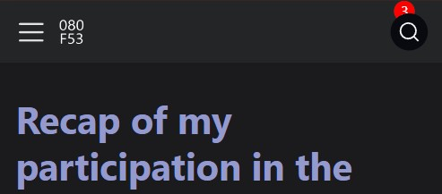
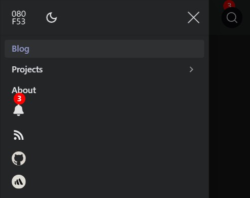
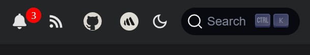
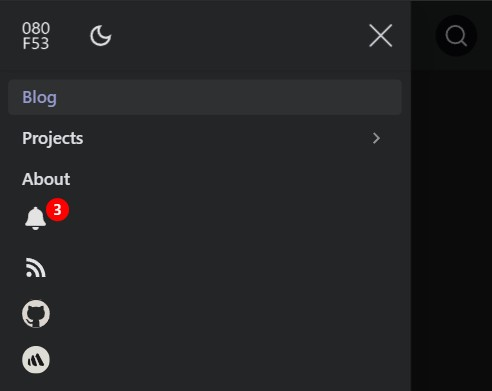

# Adding a notifications feature to my Docusaurus-based site

Recently, I added a notification feature to show noteworthy messages to visitors of my Docusaurus-based. The purpose of showing notifications when visitors are on this site is to show new or updated content in list form. While implementing this feature, I faced an unexpected challenge that needed some troubleshooting to ensure a smooth experience, especially on mobile devices.

<!-- truncate -->

## Initial implementation

The first PR ([#118](https://github.com/josh-wong/josh-wong.github.io/pull/118)) was straightforward: introduce a notification bell to the navbar on my Docusaurus-based personal site. This bell icon, highlighted in a red circle, signals whenever fresh content has been added to the custom component in my Docusaurus configuration file, `docusaurus.config.js`.

The first attempt required the user to update the notifications in the JavaScript file for the custom notification component. However, I was able to modify the code to allow users to update the notification messages in `docusaurus.config.js`. This way of updating notification messages is more in line with how other features, like the [announcement bar](https://docusaurus.io/docs/api/themes/configuration#announcement-bar), work in Docusaurus.

Thinking the feature was ready to go, I merged the PR.

## Minor style problems on mobile devices

Unfortunately, I noticed the following issues on my iPhone after merging PR [#118](https://github.com/josh-wong/josh-wong.github.io/pull/118) and seeing the site live:

- In the navbar, the notification icon appeared behind the search icon in the navbar at the top of the screen, causing a visual glitch.

  

- In the sidebar nav, the notification count was misaligned with the notification bell icon.

  

To prevent disruption on mobile, I reverted the initial PR with a follow-up PR ([#120](https://github.com/josh-wong/josh-wong.github.io/pull/120)) and dug into troubleshooting. After identifying the issue, I moved forward with a refined approach to ensure everything displayed correctly on both desktop and mobile.

## Success!

The final PR ([#121](https://github.com/josh-wong/josh-wong.github.io/pull/121)) restored the notification functionality and introduced additional improvements:

- **Notifications update dynamically:** Once opened, the notification count decreases automatically.
- **Links open contextually:** Internal links open in the same tab, while external links open in a new tab.
- **Configuration considerations:** To ensure smooth notifications, each new notification must have a unique, incremented `id` in `docusaurus.config.js`. Otherwise, they won't display as new.

The following shows the results of the implemented notifications feature:

How the notifications feature looks in the navbar on desktop:

How the notifications feature looks in the sidebar nav on mobile:

## Wrap-up

The revamped notification bell is now live on my site, ready to keep you informed of the latest updates. Working through this challenge was a valuable experience in mobile-first development, and I'm excited to use this feature to keep visitors informed of new content!

Moving forward, I'd like to try implementing this notification feature in a future version of the [official version of Docusaurus](https://github.com/facebook/docusaurus). Although the existing announcement bar is great in making single announcements, I think this notification feature could increase visitor interaction on a documentation site.
