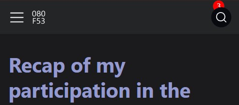
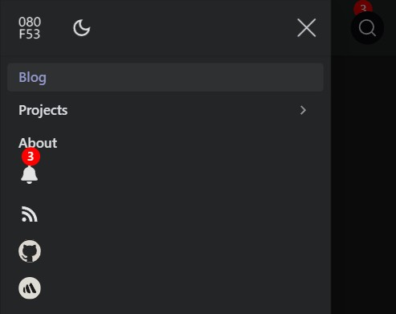
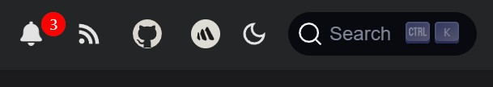
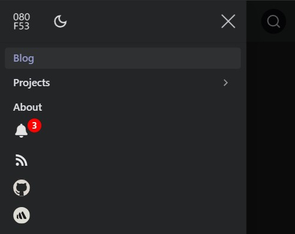

# Adding a notifications feature to my Docusaurus-based site

Recently, I added a notification feature to show noteworthy messages to visitors of my Docusaurus-based site. The purpose of having notifications is to show a short list of new or updated content. While implementing this feature, I faced an unexpected challenge that needed some troubleshooting to ensure a smooth experience, especially on mobile devices.

<!-- truncate -->

## Initial implementation

The first PR ([#118](https://github.com/josh-wong/josh-wong.github.io/pull/118)) was straightforward: Add a bell as a notification icon in the navbar on my Docusaurus-based personal site. This icon, with the number of notifications shown in a red circle, signals whenever notable content has been added. To specify when notable content is available, I add a new message to the custom notifications component, which I add in my Docusaurus configuration file, `docusaurus.config.js`.

The first attempt required the user to update the notifications in the JavaScript file for the custom notification component. However, I was able to modify the code to allow users to update the notification messages in `docusaurus.config.js`. This way of updating notification messages is more in line with how other features, like the [announcement bar](https://docusaurus.io/docs/api/themes/configuration#announcement-bar), work in Docusaurus.

After doing some quick QA on desktop and mobile, I merged the PR. However, I soon noticed some issues on the mobile version of the site.

## Issues on mobile devices

After merging PR [#118](https://github.com/josh-wong/josh-wong.github.io/pull/118), I noticed the following issues on my iPhone:

- In the navbar, the notification icon appeared behind the search icon in the navbar at the top of the screen, causing a visual glitch.

  

- In the sidebar nav, the notification count was misaligned with the notification bell icon.

  

To prevent disruption on mobile, I reverted the initial PR with a follow-up PR ([#120](https://github.com/josh-wong/josh-wong.github.io/pull/120)) and dug into troubleshooting. After identifying the issue, I moved forward with a refined approach to ensure everything displayed correctly on both desktop and mobile.

## Issues resolved and improvements implemented

The PR ([#121](https://github.com/josh-wong/josh-wong.github.io/pull/121)) restored the notification functionality, with the issues on mobile fixed, and introduced additional improvements:

- **Notifications update dynamically:** Once opened, the notification count decreases automatically.
- **Links open contextually:** Internal links open in the same tab, while external links open in a new tab.
- **Configuration considerations:** To ensure a smooth experience with updating notifications, each new notification must have a unique, incremented `id` in `docusaurus.config.js`. Otherwise, they won't display as new notifications.

The following shows the results of the implemented notifications feature:

How the notifications feature looks in the navbar on desktop:

How the notifications feature looks in the sidebar nav on mobile:

## Wrap-up

The new notification feature is now live on this site, ready to keep visitors informed of noteworthy content. Working through the challenges was a valuable experience, especially needing to consider the mobile aspect, which can vary across devices.

Although the existing announcement bar is great in making single announcements at the top of the page, I think this notification feature could increase visitor interaction on a documentation site.
