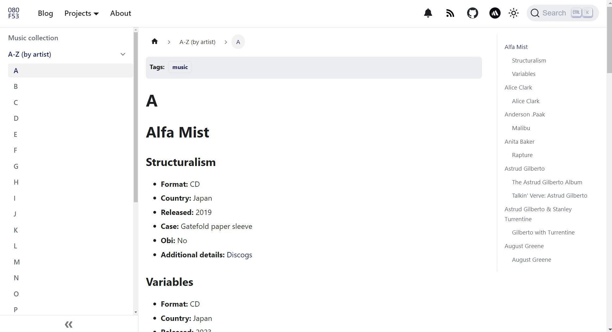

# Cataloging my collection of CDs and vinyl records

Music is more than just sound—it's a story, a mood, and a reflection of who we are. With that in mind, I wanted to combine my passion for music with my love for documenting things, including the atypical.

<!-- truncate -->

First, I created the [music collection](https://www.080f53.com/music-collection) repository, which catalogs my CDs and vinyl records. When I merge PRs that include changes to my collection, that repository syncs the updated contents to [my website repository](https://github.com/josh-wong/josh-wong.github.io). Then, my website updates with the new changes.

## Why I chose to catalog my collection of CDs and vinyl records

When you buy physical copies of music, keeping track of what albums you own can be difficult to remember. In particular, if a CD or vinyl record has multiple releases, like for specific countries, high-resolution formats, or re-releases, you might need to.

I chose to catalog my music collection so that I could:

- **Catalog my music collection:** This project is a digital keepsake for my growing collection of CDs and vinyl records, and is available whenever I need to refer to my collection.
- **Share what albums I own:** With my collections publicly available, I can share not only my collection but also my tastes in music with others.
- **Document the unordinary:** Cataloging album information is significantly different from writing guides or tutorials. Because of this, showcasing this type of information requires a different type of creativity.

## What kinds of details I chose to include about each album

In my [Music collection](https://www.080f53.com/music-collection/) project, you'll find an evolving catalog of CDs and vinyl records, each of which includes the following details:

| Details                | Options                                                                                                    |
|:-----------------------|:-----------------------------------------------------------------------------------------------------------|
| **Format**             | CD or Vinyl                                                                                                |
| **Country**            | Country of origin                                                                                          |
| **Released**           | Year the album was released                                                                                |
| **Case**               | **CDs:** Digipak, Eco pack, Gatefold paper sleeve, Jewel case, or Mini-LP sleeve **Vinyl:** Cardboard |
| **Obi**                | Yes or No                                                                                                  |
| **Additional details** | Link to a reputable site, like [Discogs](https://www.discogs.com)                                          |  

:::info

An obi is a strip of paper around the spine of a CD case that's used to advertise the CD. When reselling used CDs, collectors often favor CDs with an obi, especially if the CD is uncommon or rare and/or if the obi is from a specific series.

:::

The following screenshot shows the details that I include with each album entry:

## How I update my music collection

This project requires a few steps, some of which are automated. The process is as follows:

1. In the [music-collection](https://github.com/josh-wong/music-collection) repository, I:
    1. Create a branch.
    1. Add, update, or remove albums or album information.
    1. Create a PR that targets the **main** branch.
    1. Confirm the changes in the PR.
    1. Merge the PR.
1. The [syncing workflow](https://github.com/josh-wong/music-collection/blob/main/.github/workflows/sync-docs.yml) automatically syncs the updates as a branch to [my website repository](https://github.com/josh-wong/josh-wong.github.io).
1. The [auto-PR workflow for my music collection](https://github.com/josh-wong/josh-wong.github.io/blob/main/.github/workflows/auto-create-pr-cd-component.yml) automatically creates a PR.
1. If the checks in that PR run successfully, I merge the PR.
1. GitHub Pages builds and deploys my site by using a [workflow for Docusaurus](https://github.com/josh-wong/josh-wong.github.io/blob/main/.github/workflows/deploy.yml).

In addition, the Markdown files in [music-collection](https://github.com/josh-wong/music-collection) also sync to my personal notes in Obsidian. By having the same Markdown files available in Obsidian as well, I can browse my music collection in my private, note-taking environment and link to albums from my other notes.

## Wrap-up

Take a look at my [music collection](https://github.com/josh-wong/music-collection) and let me know what you think! I'm sure I'll update it as time goes on, so I look forward to any feedback or ideas. Above all, I hope this post inspires you to set up something similar for your own hobbies or projects.
