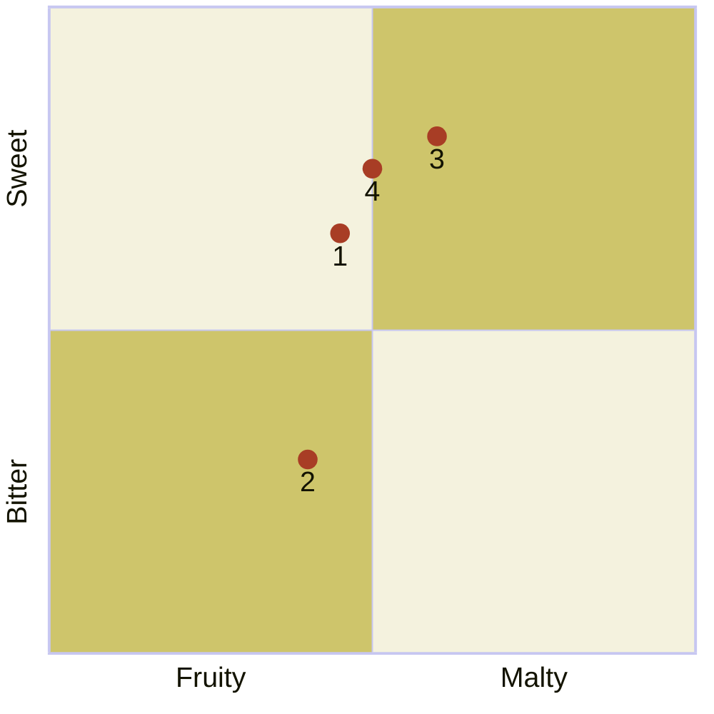

---
tags:
  - "Personal portfolio"
---

# Four Seasons Series beers

import Tabs from '@theme/Tabs';
import TabItem from '@theme/TabItem';
import ChatbotLink from '/src/components/_baird-beer-chatbot.mdx';

<ChatbotLink />

The following beers from Baird Brewing are available only during specific seasons or until they sell out. These beers are available at Baird Taprooms or in bottles.



:::note

Quadrant rankings and descriptions for each beer were created by GPT-4 from OpenAI and reviewed by a [human](https://github.com/josh-wong).

:::

## Beers and their descriptions

The following are descriptions for each of the beers in the quadrant.

<Tabs>
  <TabItem value="1" label="1" default>
    <h3>Saison Sayuri</h3>

    A fruity and slightly bitter saison with citrus and spice notes, balanced by a light malt base and a dry finish.

    **Release date:** March 21

    | Alcohol by volume (ABV) | International bitterness units (IBUs) | Color (SRM)                                  |
    |:----------------------------|:--------------------------------------|:---------------------------------------------|
    | 6.0%                        | 22                                    |  |

    ```mermaid
    %%{init: {"quadrantChart": {"xAxisLabelFontSize": 20, "yAxisLabelFontSize": 20,"pointLabelFontSize": 20, "pointRadius": 7, "pointTextPadding": 9}, "themeVariables": {"quadrantPointFill": "#a83d25", "quadrant1Fill": "#cec56b", "quadrant2Fill": "#f4f2de", "quadrant3Fill": "#cec56b", "quadrant4Fill": "#f4f2de"} }}%%
    quadrantChart
        x-axis Fruity --> Malty
        y-axis Bitter --> Sweet
        Saison Sayuri: [0.45, 0.65]
    ```

    Read more about [Saison Sayuri](https://bairdbeer.com/products/saison-sayuri) on the Baird Brewing website.
  </TabItem>
  <TabItem value="2" label="2">
    <h3>Cool Breeze Pils</h3>

    A crisp and refreshing pilsner with a clean, hop-forward bitterness and a smooth malt profile, offering subtle fruitiness.

    **Release date:** June 21

    | Alcohol by volume (ABV) | International bitterness units (IBUs) | Color (SRM)                                  |
    |:----------------------------|:--------------------------------------|:---------------------------------------------|
    | 5.5%                        | 40                                    |  |

    ```mermaid
    %%{init: {"quadrantChart": {"xAxisLabelFontSize": 20, "yAxisLabelFontSize": 20,"pointLabelFontSize": 20, "pointRadius": 7, "pointTextPadding": 9}, "themeVariables": {"quadrantPointFill": "#a83d25", "quadrant1Fill": "#cec56b", "quadrant2Fill": "#f4f2de", "quadrant3Fill": "#cec56b", "quadrant4Fill": "#f4f2de"} }}%%
    quadrantChart
        x-axis Fruity --> Malty
        y-axis Bitter --> Sweet
        Cool Breeze Pils: [0.40, 0.30]
    ```

    Read more about [Cool Breeze Pils](https://bairdbeer.com/products/cool-breeze-pils) on the Baird Brewing website.
  </TabItem>
  <TabItem value="3" label="3">
    <h3>Yabai-Yabai Strong Scotch Ale</h3>
    
    A richly sweet scotch ale with dominant caramel and toffee flavors, complemented by deep maltiness and mild bitterness.

    **Release date:** September 21

    | Alcohol by volume (ABV) | International bitterness units (IBUs) | Color (SRM)                                  |
    |:----------------------------|:--------------------------------------|:---------------------------------------------|
    | 8.0%                        | 30                                    |  |

    ```mermaid
    %%{init: {"quadrantChart": {"xAxisLabelFontSize": 20, "yAxisLabelFontSize": 20,"pointLabelFontSize": 20, "pointRadius": 7, "pointTextPadding": 9}, "themeVariables": {"quadrantPointFill": "#a83d25", "quadrant1Fill": "#cec56b", "quadrant2Fill": "#f4f2de", "quadrant3Fill": "#cec56b", "quadrant4Fill": "#f4f2de"} }}%%
    quadrantChart
        x-axis Fruity --> Malty
        y-axis Bitter --> Sweet
        Yabai-Yabai Strong Scotch Ale: [0.60, 0.80]
    ```

    Read more about [Yabai-Yabai Strong Scotch Ale](https://bairdbeer.com/products/yabai-yabai-strong-scotch-ale) on the Baird Brewing website.
  </TabItem>
  <TabItem value="4" label="4">
    <h3>Dark Sky Imperial Stout</h3>

    A robust imperial stout featuring a balanced bitterness and sweetness, with complex flavors of dark chocolate, coffee, and dark fruits.

    **Release date:** December 21

    | Alcohol by volume (ABV) | International bitterness units (IBUs) | Color (SRM)                                  |
    |:----------------------------|:--------------------------------------|:---------------------------------------------|
    | 10.0%                        | 80                                    |  |

    ```mermaid
    %%{init: {"quadrantChart": {"xAxisLabelFontSize": 20, "yAxisLabelFontSize": 20,"pointLabelFontSize": 20, "pointRadius": 7, "pointTextPadding": 9}, "themeVariables": {"quadrantPointFill": "#a83d25", "quadrant1Fill": "#cec56b", "quadrant2Fill": "#f4f2de", "quadrant3Fill": "#cec56b", "quadrant4Fill": "#f4f2de"} }}%%
    quadrantChart
        x-axis Fruity --> Malty
        y-axis Bitter --> Sweet
        Dark Sky Imperial Stout: [0.50, 0.75]
    ```

    Read more about [Dark Sky Imperial Stout](https://bairdbeer.com/products/dark-sky-imperial-stout) on the Baird Brewing website.
  </TabItem>
</Tabs>
