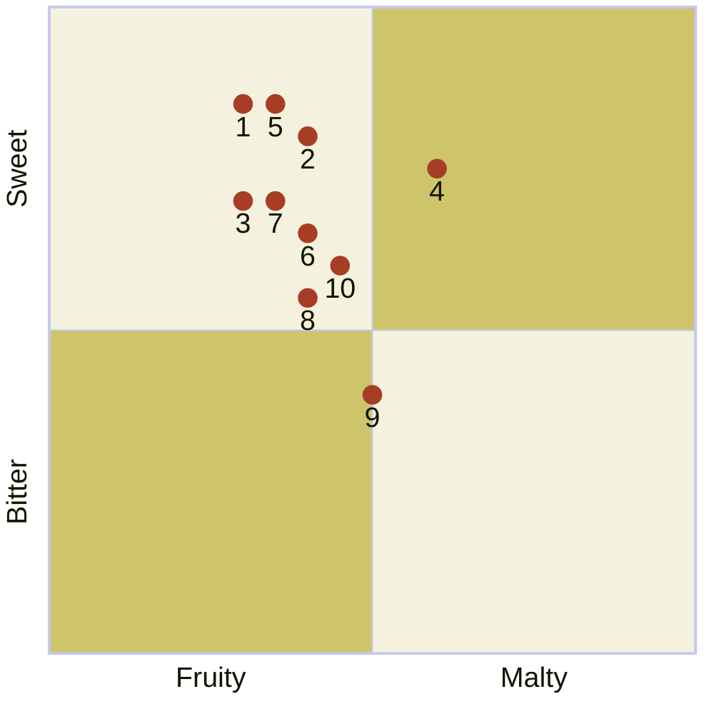

---
tags:
  - "Personal portfolio"
---

# Fruitful Life Series beers

import Tabs from '@theme/Tabs';
import TabItem from '@theme/TabItem';
import ChatbotLink from '/src/components/_baird-beer-chatbot.mdx';

<ChatbotLink />

The following fruit-themed beers from Baird Brewing are available only during certain parts of the year until they sell out. These beers are available at Baird Taprooms or in bottles.



:::note

Quadrant rankings and descriptions for each beer were created by GPT-4 from OpenAI and reviewed by a [human](https://github.com/josh-wong).

:::

## Beers and their descriptions

The following are descriptions for each of the beers in the quadrant.

<Tabs>
  <TabItem value="1" label="1" default>
    <h3>The Carpenter's Mikan Ale</h3>

    This refreshing ale is brewed with fresh mikan oranges, offering a bright, citrusy aroma and flavor that pairs harmoniously with a light malt backbone, perfect for easy drinking.

    **Release date:** January 15

    | Alcohol by volume (ABV) | International bitterness units (IBUs) | Color (SRM)                                  |
    |:----------------------------|:--------------------------------------|:---------------------------------------------|
    | 7.0%                        | 40                                    |  |

    ```mermaid
    %%{init: {"quadrantChart": {"xAxisLabelFontSize": 20, "yAxisLabelFontSize": 20,"pointLabelFontSize": 20, "pointRadius": 7, "pointTextPadding": 9}, "themeVariables": {"quadrantPointFill": "#a83d25", "quadrant1Fill": "#cec56b", "quadrant2Fill": "#f4f2de", "quadrant3Fill": "#cec56b", "quadrant4Fill": "#f4f2de"} }}%%
    quadrantChart
        x-axis Fruity --> Malty
        y-axis Bitter --> Sweet
        The Carpenter's Mikan Ale: [0.30, 0.85]
    ```

    Read more about [The Carpenter's Mikan Ale](https://bairdbeer.com/beer/the-carpenters-mikan-ale) on the Baird Brewing website.
  </TabItem>
  <TabItem value="2" label="2">
    <h3>Temple Garden Yuzu Ale</h3>

    Infused with aromatic yuzu fruit, this ale delivers a crisp and tangy citrus flavor, complemented by a subtle malt sweetness, making it a zesty and invigorating experience.

    **Release date:** February 15

    | Alcohol by volume (ABV) | International bitterness units (IBUs) | Color (SRM)                                  |
    |:----------------------------|:--------------------------------------|:---------------------------------------------|
    | 6.0%                        | 25                                    |  |

    ```mermaid
    %%{init: {"quadrantChart": {"xAxisLabelFontSize": 20, "yAxisLabelFontSize": 20,"pointLabelFontSize": 20, "pointRadius": 7, "pointTextPadding": 9}, "themeVariables": {"quadrantPointFill": "#a83d25", "quadrant1Fill": "#cec56b", "quadrant2Fill": "#f4f2de", "quadrant3Fill": "#cec56b", "quadrant4Fill": "#f4f2de"} }}%%
    quadrantChart
        x-axis Fruity --> Malty
        y-axis Bitter --> Sweet
        Temple Garden Yuzu Ale: [0.40, 0.80]
    ```

    Read more about [Temple Garden Yuzu Ale](https://bairdbeer.com/beer/temple-garden-yuzu-ale) on the Baird Brewing website.
  </TabItem>
  <TabItem value="3" label="3">
    <h3>Second Strike Apple Ale</h3>

    Brewed with fresh apples, this ale offers a crisp apple flavor with a balanced sweetness and a hint of tartness, making it a fruit-forward beer that's both refreshing and complex.

    **Release date:** March 15

    | Alcohol by volume (ABV) | International bitterness units (IBUs) | Color (SRM)                                  |
    |:----------------------------|:--------------------------------------|:---------------------------------------------|
    | 4.0%                        | 10                                    |  |

    ```mermaid
    %%{init: {"quadrantChart": {"xAxisLabelFontSize": 20, "yAxisLabelFontSize": 20,"pointLabelFontSize": 20, "pointRadius": 7, "pointTextPadding": 9}, "themeVariables": {"quadrantPointFill": "#a83d25", "quadrant1Fill": "#cec56b", "quadrant2Fill": "#f4f2de", "quadrant3Fill": "#cec56b", "quadrant4Fill": "#f4f2de"} }}%%
    quadrantChart
        x-axis Fruity --> Malty
        y-axis Bitter --> Sweet
        Second Strike Apple Ale: [0.30, 0.70]
    ```

    Read more about [Second Strike Apple Ale](https://bairdbeer.com/beer/second-strike-apple-ale) on the Baird Brewing website.
  </TabItem>
  <TabItem value="4" label="4">
    <h3>Fruitful Life Citrus IPA</h3>

    A hop-forward IPA enhanced with citrus fruits like orange and lemon, this beer bursts with juicy, fruity flavors and a solid bitterness, creating a lively and refreshing drinking experience.

    **Release date:** April 15

    | Alcohol by volume (ABV) | International bitterness units (IBUs) | Color (SRM)                                  |
    |:----------------------------|:--------------------------------------|:---------------------------------------------|
    | 7.0%                        | 65                                    |  |

    ```mermaid
    %%{init: {"quadrantChart": {"xAxisLabelFontSize": 20, "yAxisLabelFontSize": 20,"pointLabelFontSize": 20, "pointRadius": 7, "pointTextPadding": 9}, "themeVariables": {"quadrantPointFill": "#a83d25", "quadrant1Fill": "#cec56b", "quadrant2Fill": "#f4f2de", "quadrant3Fill": "#cec56b", "quadrant4Fill": "#f4f2de"} }}%%
    quadrantChart
        x-axis Fruity --> Malty
        y-axis Bitter --> Sweet
        Fruitful Life Citrus IPA: [0.60, 0.75]
    ```

    Read more about [Fruitful Life Citrus IPA](https://bairdbeer.com/beer/fruitful-life-citrus-ipa) on the Baird Brewing website.
  </TabItem>
  <TabItem value="5" label="5">
    <h3>Shizuoka Summer Mikan Ale</h3>

    This summer ale showcases the vibrant flavors of local mikan oranges, providing a juicy, citrusy profile with a light, thirst-quenching body that's perfect for warm weather.

    **Release date:** May 15

    | Alcohol by volume (ABV) | International bitterness units (IBUs) | Color (SRM)                                  |
    |:----------------------------|:--------------------------------------|:---------------------------------------------|
    | 5.0%                        | 15                                    |  |

    ```mermaid
    %%{init: {"quadrantChart": {"xAxisLabelFontSize": 20, "yAxisLabelFontSize": 20,"pointLabelFontSize": 20, "pointRadius": 7, "pointTextPadding": 9}, "themeVariables": {"quadrantPointFill": "#a83d25", "quadrant1Fill": "#cec56b", "quadrant2Fill": "#f4f2de", "quadrant3Fill": "#cec56b", "quadrant4Fill": "#f4f2de"} }}%%
    quadrantChart
        x-axis Fruity --> Malty
        y-axis Bitter --> Sweet
        Shizuoka Summer Mikan Ale: [0.35, 0.85]
    ```

    Read more about [Shizuoka Summer Mikan Ale](https://bairdbeer.com/beer/shizuoka-summer-mikan-ale) on the Baird Brewing website.
  </TabItem>
  <TabItem value="6" label="6">
    <h3>Japan Tale Ale</h3>

    A unique ale brewed with native Japanese fruits, offering a delicate balance of sweetness and tartness with subtle malt undertones, creating a beer that tells a story of Japan's rich fruit heritage.

    **Release date:** July 15

    | Alcohol by volume (ABV) | International bitterness units (IBUs) | Color (SRM)                                  |
    |:----------------------------|:--------------------------------------|:---------------------------------------------|
    | 5.0%                        | 10                                    |  |

    ```mermaid
    %%{init: {"quadrantChart": {"xAxisLabelFontSize": 20, "yAxisLabelFontSize": 20,"pointLabelFontSize": 20, "pointRadius": 7, "pointTextPadding": 9}, "themeVariables": {"quadrantPointFill": "#a83d25", "quadrant1Fill": "#cec56b", "quadrant2Fill": "#f4f2de", "quadrant3Fill": "#cec56b", "quadrant4Fill": "#f4f2de"} }}%%
    quadrantChart
        x-axis Fruity --> Malty
        y-axis Bitter --> Sweet
        Japan Tale Ale: [0.40, 0.65]
    ```

    Read more about [Japan Tale Ale](https://bairdbeer.com/beer/japan-tale-ale) on the Baird Brewing website.
  </TabItem>
  <TabItem value="7" label="7">
    <h3>Asian Beauty Biwa Ale</h3>

    This ale is brewed with biwa (loquat) fruit, offering a delicate and slightly sweet flavor with hints of apricot and peach, balanced by a gentle malt character.

    **Release date:** August 15

    | Alcohol by volume (ABV) | International bitterness units (IBUs) | Color (SRM)                                  |
    |:----------------------------|:--------------------------------------|:---------------------------------------------|
    | 4.0%                        | 10                                    |  |

    ```mermaid
    %%{init: {"quadrantChart": {"xAxisLabelFontSize": 20, "yAxisLabelFontSize": 20,"pointLabelFontSize": 20, "pointRadius": 7, "pointTextPadding": 9}, "themeVariables": {"quadrantPointFill": "#a83d25", "quadrant1Fill": "#cec56b", "quadrant2Fill": "#f4f2de", "quadrant3Fill": "#cec56b", "quadrant4Fill": "#f4f2de"} }}%%
    quadrantChart
        x-axis Fruity --> Malty
        y-axis Bitter --> Sweet
        Asian Beauty Biwa Ale: [0.35, 0.70]
    ```

    Read more about [Asian Beauty Biwa Ale](https://bairdbeer.com/beer/asian-beauty-biwa-lager) on the Baird Brewing website.
  </TabItem>
  <TabItem value="8" label="8">
    <h3>Country Girl Kabocha Ale</h3>

    A seasonal ale brewed with kabocha (Japanese pumpkin), providing a rich, earthy flavor with notes of roasted squash and a touch of sweetness, perfect for autumn.

    **Release date:** October 15

    | Alcohol by volume (ABV) | International bitterness units (IBUs) | Color (SRM)                                  |
    |:----------------------------|:--------------------------------------|:---------------------------------------------|
    | 6.5%                        | 25                                    |  |

    ```mermaid
    %%{init: {"quadrantChart": {"xAxisLabelFontSize": 20, "yAxisLabelFontSize": 20,"pointLabelFontSize": 20, "pointRadius": 7, "pointTextPadding": 9}, "themeVariables": {"quadrantPointFill": "#a83d25", "quadrant1Fill": "#cec56b", "quadrant2Fill": "#f4f2de", "quadrant3Fill": "#cec56b", "quadrant4Fill": "#f4f2de"} }}%%
    quadrantChart
        x-axis Fruity --> Malty
        y-axis Bitter --> Sweet
        Country Girl Kabocha Ale: [0.40, 0.55]
    ```

    Read more about [Country Girl Kabocha Ale](https://bairdbeer.com/beer/country-girl-kabocha-ale) on the Baird Brewing website.
  </TabItem>
  <TabItem value="9" label="9">
    <h3>Smoke & Fire Habanero Stout</h3>

    This bold stout combines rich, roasted malt flavors with the fiery heat of habanero peppers, delivering a unique and spicy twist on the classic stout profile.

    **Release date:** November 15

    | Alcohol by volume (ABV) | International bitterness units (IBUs) | Color (SRM)                                  |
    |:----------------------------|:--------------------------------------|:---------------------------------------------|
    | 5.5%                        | 25                                    |  |

    ```mermaid
    %%{init: {"quadrantChart": {"xAxisLabelFontSize": 20, "yAxisLabelFontSize": 20,"pointLabelFontSize": 20, "pointRadius": 7, "pointTextPadding": 9}, "themeVariables": {"quadrantPointFill": "#a83d25", "quadrant1Fill": "#cec56b", "quadrant2Fill": "#f4f2de", "quadrant3Fill": "#cec56b", "quadrant4Fill": "#f4f2de"} }}%%
    quadrantChart
        x-axis Fruity --> Malty
        y-axis Bitter --> Sweet
        Smoke & Fire Habanero Stout: [0.50, 0.40]
    ```

    Read more about [Smoke & Fire Habanero Stout](https://bairdbeer.com/beer/smoke-fire-habanero-stout) on the Baird Brewing website.
  </TabItem>
  <TabItem value="10" label="10">
    <h3>Jubilation Ale</h3>

    A festive ale brewed with seasonal spices and fruits, offering a complex blend of warm, spiced flavors with a fruity sweetness, making it a perfect beer for celebratory occasions.

    **Release date:** December 15

    | Alcohol by volume (ABV) | International bitterness units (IBUs) | Color (SRM)                                  |
    |:----------------------------|:--------------------------------------|:---------------------------------------------|
    | 8.0%                        | 28                                    |  |

    ```mermaid
    %%{init: {"quadrantChart": {"xAxisLabelFontSize": 20, "yAxisLabelFontSize": 20,"pointLabelFontSize": 20, "pointRadius": 7, "pointTextPadding": 9}, "themeVariables": {"quadrantPointFill": "#a83d25", "quadrant1Fill": "#cec56b", "quadrant2Fill": "#f4f2de", "quadrant3Fill": "#cec56b", "quadrant4Fill": "#f4f2de"} }}%%
    quadrantChart
        x-axis Fruity --> Malty
        y-axis Bitter --> Sweet
        Jubilation Ale: [0.45, 0.60]
    ```

    Read more about [Jubilation Ale](https://bairdbeer.com/beer/jubilation-ale) on the Baird Brewing website.
  </TabItem>
</Tabs>
