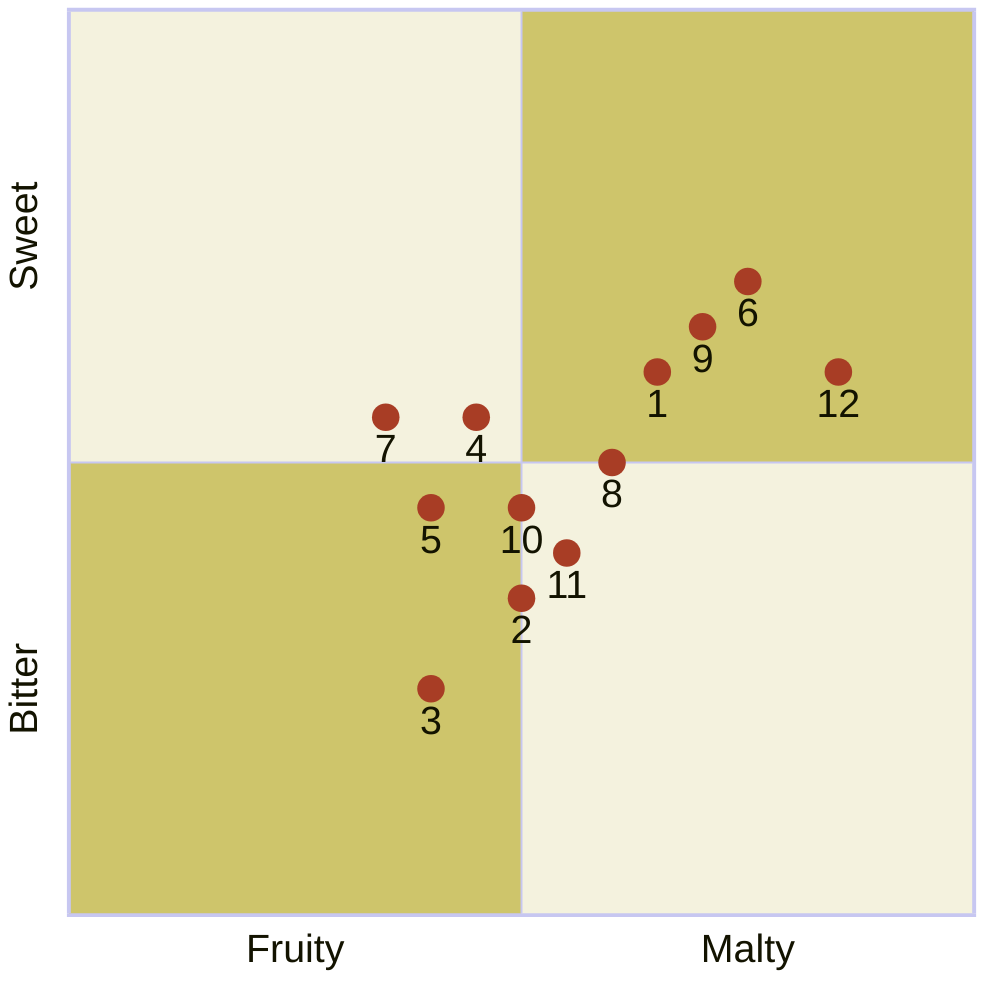

---
tags:
  - "Personal portfolio"
---

# Monthly Style Series beers

import Tabs from '@theme/Tabs';
import TabItem from '@theme/TabItem';

The following beers from Baird Brewing are available only during certain months or until they sell out. These beers are available at Baird Taprooms or in bottles.



:::note

Quadrant rankings and descriptions for each beer were created by GPT-4 from OpenAI and reviewed by a [human](https://github.com/josh-wong).

:::

## Beers and their descriptions

The following are descriptions for each of the beers in the quadrant.

<Tabs>
  <TabItem value="1" label="1" default>
    <h3>Hatsujozo India Pale Lager</h3>

    A crisp and refreshing lager with a robust hop profile, this India Pale Lager combines the clean finish of a lager with the bold, fruity bitterness typical of an IPA.

    ```mermaid
    %%{init: {"quadrantChart": {"xAxisLabelFontSize": 20, "yAxisLabelFontSize": 20,"pointLabelFontSize": 20, "pointRadius": 7, "pointTextPadding": 9}, "themeVariables": {"quadrantPointFill": "#a83d25", "quadrant1Fill": "#cec56b", "quadrant2Fill": "#f4f2de", "quadrant3Fill": "#cec56b", "quadrant4Fill": "#f4f2de"} }}%%
    quadrantChart
        x-axis Fruity --> Malty
        y-axis Bitter --> Sweet
        Hatsujozo India Pale Lager: [0.65, 0.60]
    ```
  </TabItem>
  <TabItem value="2" label="2">
    <h3>Ganko Oyaji Barley Wine</h3>

    This strong and complex barley wine boasts rich flavors of caramel, toffee, and dark fruit, with a warming alcohol presence and a lingering bitterness that balances its sweetness.

    ```mermaid
    %%{init: {"quadrantChart": {"xAxisLabelFontSize": 20, "yAxisLabelFontSize": 20,"pointLabelFontSize": 20, "pointRadius": 7, "pointTextPadding": 9}, "themeVariables": {"quadrantPointFill": "#a83d25", "quadrant1Fill": "#cec56b", "quadrant2Fill": "#f4f2de", "quadrant3Fill": "#cec56b", "quadrant4Fill": "#f4f2de"} }}%%
    quadrantChart
        x-axis Fruity --> Malty
        y-axis Bitter --> Sweet
        Ganko Oyaji Barley Wine: [0.50, 0.35]
    ```
  </TabItem>
  <TabItem value="3" label="3">
    <h3>Morning Coffee Stout</h3>

    A rich, dark stout brewed with freshly roasted coffee beans, delivering bold coffee aromas and flavors, complemented by roasted malt and a smooth, creamy finish.

    ```mermaid
    %%{init: {"quadrantChart": {"xAxisLabelFontSize": 20, "yAxisLabelFontSize": 20,"pointLabelFontSize": 20, "pointRadius": 7, "pointTextPadding": 9}, "themeVariables": {"quadrantPointFill": "#a83d25", "quadrant1Fill": "#cec56b", "quadrant2Fill": "#f4f2de", "quadrant3Fill": "#cec56b", "quadrant4Fill": "#f4f2de"} }}%%
    quadrantChart
        x-axis Fruity --> Malty
        y-axis Bitter --> Sweet
        Morning Coffee Stout: [0.40, 0.25]
    ```
  </TabItem>
  <TabItem value="4" label="4">
    <h3>Bureiko Jikan Strong Golden Ale</h3>

    This golden ale is robust and full-bodied, with a fruity and spicy character, balanced by a solid malt backbone and a warming alcohol presence.

    ```mermaid
    %%{init: {"quadrantChart": {"xAxisLabelFontSize": 20, "yAxisLabelFontSize": 20,"pointLabelFontSize": 20, "pointRadius": 7, "pointTextPadding": 9}, "themeVariables": {"quadrantPointFill": "#a83d25", "quadrant1Fill": "#cec56b", "quadrant2Fill": "#f4f2de", "quadrant3Fill": "#cec56b", "quadrant4Fill": "#f4f2de"} }}%%
    quadrantChart
        x-axis Fruity --> Malty
        y-axis Bitter --> Sweet
        Bureiko Jikan Strong Golden Ale: [0.45, 0.55]
    ```
  </TabItem>
  <TabItem value="5" label="5">
    <h3>Four Sisters Spring Bock</h3>

    A traditional bock beer with a rich malt profile, offering smooth caramel and toasty flavors, balanced by a light bitterness and a slightly sweet finish.

    ```mermaid
    %%{init: {"quadrantChart": {"xAxisLabelFontSize": 20, "yAxisLabelFontSize": 20,"pointLabelFontSize": 20, "pointRadius": 7, "pointTextPadding": 9}, "themeVariables": {"quadrantPointFill": "#a83d25", "quadrant1Fill": "#cec56b", "quadrant2Fill": "#f4f2de", "quadrant3Fill": "#cec56b", "quadrant4Fill": "#f4f2de"} }}%%
    quadrantChart
        x-axis Fruity --> Malty
        y-axis Bitter --> Sweet
        Four Sisters Spring Bock: [0.40, 0.45]
    ```
  </TabItem>
  <TabItem value="6" label="6">
    <h3>Hop Havoc Imperial Pale Ale</h3>

    This imperial pale ale is aggressively hopped, delivering intense citrus and pine flavors, backed by a strong malt presence that balances the high bitterness.

    ```mermaid
    %%{init: {"quadrantChart": {"xAxisLabelFontSize": 20, "yAxisLabelFontSize": 20,"pointLabelFontSize": 20, "pointRadius": 7, "pointTextPadding": 9}, "themeVariables": {"quadrantPointFill": "#a83d25", "quadrant1Fill": "#cec56b", "quadrant2Fill": "#f4f2de", "quadrant3Fill": "#cec56b", "quadrant4Fill": "#f4f2de"} }}%%
    quadrantChart
        x-axis Fruity --> Malty
        y-axis Bitter --> Sweet
        Hop Havoc Imperial Pale Ale: [0.75, 0.70]
    ```
  </TabItem>
  <TabItem value="7" label="7">
    <h3>Joie de Vivre</h3>

    A refreshing and lively ale with a fruity and floral hop character, balanced by a smooth malt base, making it a vibrant and easy-drinking beer.

    ```mermaid
    %%{init: {"quadrantChart": {"xAxisLabelFontSize": 20, "yAxisLabelFontSize": 20,"pointLabelFontSize": 20, "pointRadius": 7, "pointTextPadding": 9}, "themeVariables": {"quadrantPointFill": "#a83d25", "quadrant1Fill": "#cec56b", "quadrant2Fill": "#f4f2de", "quadrant3Fill": "#cec56b", "quadrant4Fill": "#f4f2de"} }}%%
    quadrantChart
        x-axis Fruity --> Malty
        y-axis Bitter --> Sweet
        Joie de Vivre: [0.35, 0.55]
    ```
  </TabItem>
  <TabItem value="8" label="8">
    <h3>Public House Bitter</h3>

    A classic English-style bitter with a balanced malt and hop profile, offering toasty and caramel malt flavors with a gentle bitterness, perfect for a sessionable pint.

    ```mermaid
    %%{init: {"quadrantChart": {"xAxisLabelFontSize": 20, "yAxisLabelFontSize": 20,"pointLabelFontSize": 20, "pointRadius": 7, "pointTextPadding": 9}, "themeVariables": {"quadrantPointFill": "#a83d25", "quadrant1Fill": "#cec56b", "quadrant2Fill": "#f4f2de", "quadrant3Fill": "#cec56b", "quadrant4Fill": "#f4f2de"} }}%%
    quadrantChart
        x-axis Fruity --> Malty
        y-axis Bitter --> Sweet
        Public House Bitter: [0.60, 0.50]
    ```
  </TabItem>
  <TabItem value="9" label="9">
    <h3>Brewer's Nightmare Rye IPA</h3>

    A bold IPA brewed with rye malt, adding a spicy complexity to the citrusy and piney hop flavors, resulting in a unique and flavorful beer.

    ```mermaid
    %%{init: {"quadrantChart": {"xAxisLabelFontSize": 20, "yAxisLabelFontSize": 20,"pointLabelFontSize": 20, "pointRadius": 7, "pointTextPadding": 9}, "themeVariables": {"quadrantPointFill": "#a83d25", "quadrant1Fill": "#cec56b", "quadrant2Fill": "#f4f2de", "quadrant3Fill": "#cec56b", "quadrant4Fill": "#f4f2de"} }}%%
    quadrantChart
        x-axis Fruity --> Malty
        y-axis Bitter --> Sweet
        Brewer's Nightmare Rye IPA: [0.70, 0.65]
    ```
  </TabItem>
  <TabItem value="10" label="10">
    <h3>Fest Lager</h3>

    A smooth and malty lager, inspired by traditional German festbiers, with a rich, bready malt profile and a clean, balanced finish, making it ideal for celebration.

    ```mermaid
    %%{init: {"quadrantChart": {"xAxisLabelFontSize": 20, "yAxisLabelFontSize": 20,"pointLabelFontSize": 20, "pointRadius": 7, "pointTextPadding": 9}, "themeVariables": {"quadrantPointFill": "#a83d25", "quadrant1Fill": "#cec56b", "quadrant2Fill": "#f4f2de", "quadrant3Fill": "#cec56b", "quadrant4Fill": "#f4f2de"} }}%%
    quadrantChart
        x-axis Fruity --> Malty
        y-axis Bitter --> Sweet
        Fest Lager: [0.50, 0.45]
    ```
  </TabItem>
  <TabItem value="11" label="11">
    <h3>West Coast Wheat Wine</h3>

    A strong and complex wheat wine with bold hop flavors, delivering a unique combination of wheat malt sweetness and intense hop bitterness, typical of the West Coast style.

    ```mermaid
    %%{init: {"quadrantChart": {"xAxisLabelFontSize": 20, "yAxisLabelFontSize": 20,"pointLabelFontSize": 20, "pointRadius": 7, "pointTextPadding": 9}, "themeVariables": {"quadrantPointFill": "#a83d25", "quadrant1Fill": "#cec56b", "quadrant2Fill": "#f4f2de", "quadrant3Fill": "#cec56b", "quadrant4Fill": "#f4f2de"} }}%%
    quadrantChart
        x-axis Fruity --> Malty
        y-axis Bitter --> Sweet
        West Coast Wheat Wine: [0.55, 0.40]
    ```
  </TabItem>
  <TabItem value="12" label="12">
    <h3>Bakayaro! Ale</h3>

    This strong ale is fiercely bitter with a powerful hop presence, balanced by a robust malt backbone, making it an intense and flavorful experience for the adventurous beer drinker.

    ```mermaid
    %%{init: {"quadrantChart": {"xAxisLabelFontSize": 20, "yAxisLabelFontSize": 20,"pointLabelFontSize": 20, "pointRadius": 7, "pointTextPadding": 9}, "themeVariables": {"quadrantPointFill": "#a83d25", "quadrant1Fill": "#cec56b", "quadrant2Fill": "#f4f2de", "quadrant3Fill": "#cec56b", "quadrant4Fill": "#f4f2de"} }}%%
    quadrantChart
        x-axis Fruity --> Malty
        y-axis Bitter --> Sweet
        Bakayaro! Ale: [0.85, 0.60]
    ```
  </TabItem>
</Tabs>
