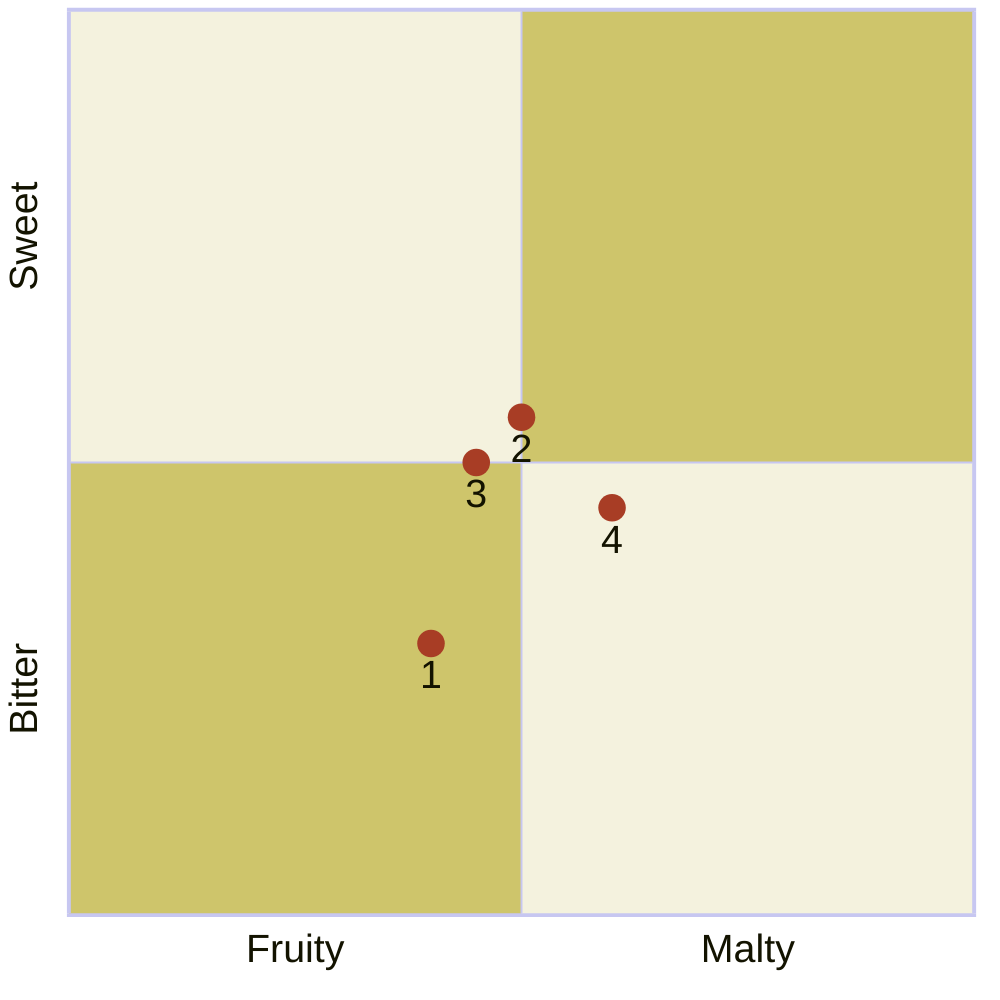

---
tags:
  - "Personal portfolio"
---

# Taproom-exclusive beers

import Tabs from '@theme/Tabs';
import TabItem from '@theme/TabItem';

The following beers from Baird Brewing are available at only specific Baird Taprooms.



:::note

Quadrant rankings and descriptions for each beer were created by GPT-4 from OpenAI and reviewed by a [human](https://github.com/josh-wong).

:::

## Beers and their descriptions

The following are descriptions for each of the beers in the quadrant.

<Tabs>
  <TabItem value="1" label="1" default>
    <h3>Baba Oatmeal Smoke Porter</h3>

    A rich and smoky porter brewed with oatmeal for a smooth, creamy mouthfeel, offering deep roasted malt flavors balanced by a subtle smokiness and a hint of sweetness.

    | Alcohol by volume (ABV) | International bitterness units (IBUs) | Color (SRM)                                  |
    |:----------------------------|:--------------------------------------|:---------------------------------------------|
    | 5.7%                        | ???                                    |  |

    ```mermaid
    %%{init: {"quadrantChart": {"xAxisLabelFontSize": 20, "yAxisLabelFontSize": 20,"pointLabelFontSize": 20, "pointRadius": 7, "pointTextPadding": 9}, "themeVariables": {"quadrantPointFill": "#a83d25", "quadrant1Fill": "#cec56b", "quadrant2Fill": "#f4f2de", "quadrant3Fill": "#cec56b", "quadrant4Fill": "#f4f2de"} }}%%
    quadrantChart
        x-axis Fruity --> Malty
        y-axis Bitter --> Sweet
        Baba Oatmeal Smoke Porter: [0.40, 0.30]
    ```
  </TabItem>
  <TabItem value="2" label="2">
    <h3>Bashamichi Ale</h3>

    A well-balanced English-style ale with a toasty malt character and a moderate hop bitterness, offering a smooth, easy-drinking experience with a touch of caramel sweetness.

    | Alcohol by volume (ABV) | International bitterness units (IBUs) | Color (SRM)                                  |
    |:----------------------------|:--------------------------------------|:---------------------------------------------|
    | 5.7%                        | 25                                    |  |

    ```mermaid
    %%{init: {"quadrantChart": {"xAxisLabelFontSize": 20, "yAxisLabelFontSize": 20,"pointLabelFontSize": 20, "pointRadius": 7, "pointTextPadding": 9}, "themeVariables": {"quadrantPointFill": "#a83d25", "quadrant1Fill": "#cec56b", "quadrant2Fill": "#f4f2de", "quadrant3Fill": "#cec56b", "quadrant4Fill": "#f4f2de"} }}%%
    quadrantChart
        x-axis Fruity --> Malty
        y-axis Bitter --> Sweet
        Bashamichi Ale: [0.50, 0.55]
    ```
  </TabItem>
  <TabItem value="3" label="3">
    <h3>Harajuku Ale</h3>

    A light and refreshing ale with a subtle fruity aroma and a gentle malt backbone, capturing the lively and vibrant spirit of Harajuku in a sessionable brew.

    | Alcohol by volume (ABV) | International bitterness units (IBUs) | Color (SRM)                                  |
    |:----------------------------|:--------------------------------------|:---------------------------------------------|
    | 6.1%                        | ???                                    |  |

    ```mermaid
    %%{init: {"quadrantChart": {"xAxisLabelFontSize": 20, "yAxisLabelFontSize": 20,"pointLabelFontSize": 20, "pointRadius": 7, "pointTextPadding": 9}, "themeVariables": {"quadrantPointFill": "#a83d25", "quadrant1Fill": "#cec56b", "quadrant2Fill": "#f4f2de", "quadrant3Fill": "#cec56b", "quadrant4Fill": "#f4f2de"} }}%%
    quadrantChart
        x-axis Fruity --> Malty
        y-axis Bitter --> Sweet
        Harajuku Ale: [0.45, 0.50]
    ```
  </TabItem>
  <TabItem value="4" label="4">
    <h3>Nakameguro Bitter</h3>
    
    A classic English-style bitter with a smooth malt profile, featuring caramel and toasty flavors complemented by a mild hop bitterness, making it a perfect pub ale.

    | Alcohol by volume (ABV) | International bitterness units (IBUs) | Color (SRM)                                  |
    |:----------------------------|:--------------------------------------|:---------------------------------------------|
    | 4.5%                        | ???                                    |  |

    ```mermaid
    %%{init: {"quadrantChart": {"xAxisLabelFontSize": 20, "yAxisLabelFontSize": 20,"pointLabelFontSize": 20, "pointRadius": 7, "pointTextPadding": 9}, "themeVariables": {"quadrantPointFill": "#a83d25", "quadrant1Fill": "#cec56b", "quadrant2Fill": "#f4f2de", "quadrant3Fill": "#cec56b", "quadrant4Fill": "#f4f2de"} }}%%
    quadrantChart
        x-axis Fruity --> Malty
        y-axis Bitter --> Sweet
        Nakameguro Bitter: [0.60, 0.45]
    ```
  </TabItem>
</Tabs>
