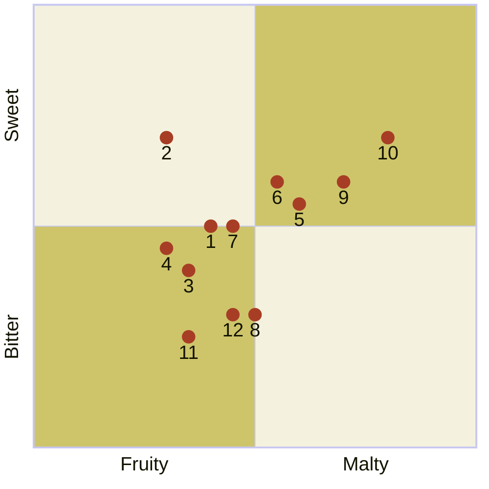

---
tags:
  - "Personal portfolio"
---

# Year-Round beers

import Tabs from '@theme/Tabs';
import TabItem from '@theme/TabItem';

The following beers from Baird Brewing are available year round. These beers are available at Baird Taprooms or in bottles.



:::note

Quadrant rankings and descriptions for each beer were created by GPT-4 from OpenAI and reviewed by a [human](https://github.com/josh-wong).

:::

## Beers and their descriptions

The following are descriptions for each of the beers in the quadrant.

<Tabs>
  <TabItem value="1" label="1" default>
    <h3>Single Take Session Ale</h3>

    A crisp and easy-drinking session ale with light malt flavors and a refreshing hop bitterness, making it a perfect choice for a laid-back drinking experience.

    | Alcohol by volume (ABV) | International bitterness units (IBUs) | Color (SRM)                                           |
    |:----------------------------|:--------------------------------------|:------------------------------------------------------|
    | 4.5%                        | 16                                    |  |

    ```mermaid
    %%{init: {"quadrantChart": {"xAxisLabelFontSize": 20, "yAxisLabelFontSize": 20,"pointLabelFontSize": 20, "pointRadius": 7, "pointTextPadding": 9}, "themeVariables": {"quadrantPointFill": "#a83d25", "quadrant1Fill": "#cec56b", "quadrant2Fill": "#f4f2de", "quadrant3Fill": "#cec56b", "quadrant4Fill": "#f4f2de"} }}%%
    quadrantChart
        x-axis Fruity --> Malty
        y-axis Bitter --> Sweet
        Single Take Session Ale: [0.40, 0.50]
    ```
  </TabItem>
  <TabItem value="2" label="2">
    <h3>Wheat King Wit</h3>

    A Belgian-style witbier brewed with wheat, orange peel, and coriander, offering a light and refreshing body with bright citrus and spice notes, ideal for warm weather.

    | Alcohol by volume (ABV) | International bitterness units (IBUs) | Color (SRM)                                  |
    |:----------------------------|:--------------------------------------|:---------------------------------------------|
    | 5.0%                        | 15                                    |  |

    ```mermaid
    %%{init: {"quadrantChart": {"xAxisLabelFontSize": 20, "yAxisLabelFontSize": 20,"pointLabelFontSize": 20, "pointRadius": 7, "pointTextPadding": 9}, "themeVariables": {"quadrantPointFill": "#a83d25", "quadrant1Fill": "#cec56b", "quadrant2Fill": "#f4f2de", "quadrant3Fill": "#cec56b", "quadrant4Fill": "#f4f2de"} }}%%
    quadrantChart
        x-axis Fruity --> Malty
        y-axis Bitter --> Sweet
        Wheat King Wit: [0.30, 0.70]
    ```
  </TabItem>
  <TabItem value="3" label="3">
    <h3>Shuzenji Heritage Helles</h3>

    A classic German-style Helles lager with a clean, malt-forward profile, offering smooth and bready flavors with a mild hop bitterness and a crisp finish.

    | Alcohol by volume (ABV) | International bitterness units (IBUs) | Color (SRM)                                  |
    |:----------------------------|:--------------------------------------|:---------------------------------------------|
    | 5.0%                        | 18                                    |  |

    ```mermaid
    %%{init: {"quadrantChart": {"xAxisLabelFontSize": 20, "yAxisLabelFontSize": 20,"pointLabelFontSize": 20, "pointRadius": 7, "pointTextPadding": 9}, "themeVariables": {"quadrantPointFill": "#a83d25", "quadrant1Fill": "#cec56b", "quadrant2Fill": "#f4f2de", "quadrant3Fill": "#cec56b", "quadrant4Fill": "#f4f2de"} }}%%
    quadrantChart
        x-axis Fruity --> Malty
        y-axis Bitter --> Sweet
        Shuzenji Heritage Helles: [0.35, 0.40]
    ```
  </TabItem>
  <TabItem value="4" label="4">
    <h3>Numazu Lager</h3>

    A well-balanced, easy-drinking lager with a light malt sweetness and a gentle hop bitterness, delivering a clean and refreshing taste.

    | Alcohol by volume (ABV) | International bitterness units (IBUs) | Color (SRM)                                  |
    |:----------------------------|:--------------------------------------|:---------------------------------------------|
    | 5.5%                        | 28                                    |  |

    ```mermaid
    %%{init: {"quadrantChart": {"xAxisLabelFontSize": 20, "yAxisLabelFontSize": 20,"pointLabelFontSize": 20, "pointRadius": 7, "pointTextPadding": 9}, "themeVariables": {"quadrantPointFill": "#a83d25", "quadrant1Fill": "#cec56b", "quadrant2Fill": "#f4f2de", "quadrant3Fill": "#cec56b", "quadrant4Fill": "#f4f2de"} }}%%
    quadrantChart
        x-axis Fruity --> Malty
        y-axis Bitter --> Sweet
        Numazu Lager: [0.30, 0.45]
    ```
  </TabItem>
  <TabItem value="5" label="5">
    <h3>Rising Sun Pale Ale</h3>

    A vibrant pale ale with a citrusy and floral hop character, balanced by a solid malt backbone, making it a flavorful yet approachable beer.

    | Alcohol by volume (ABV) | International bitterness units (IBUs) | Color (SRM)                                  |
    |:----------------------------|:--------------------------------------|:---------------------------------------------|
    | 5.5%                        | 34                                    |  |

    ```mermaid
    %%{init: {"quadrantChart": {"xAxisLabelFontSize": 20, "yAxisLabelFontSize": 20,"pointLabelFontSize": 20, "pointRadius": 7, "pointTextPadding": 9}, "themeVariables": {"quadrantPointFill": "#a83d25", "quadrant1Fill": "#cec56b", "quadrant2Fill": "#f4f2de", "quadrant3Fill": "#cec56b", "quadrant4Fill": "#f4f2de"} }}%%
    quadrantChart
        x-axis Fruity --> Malty
        y-axis Bitter --> Sweet
        Rising Sun Pale Ale: [0.60, 0.55]
    ```
  </TabItem>
  <TabItem value="6" label="6">
    <h3>Wabi-Sabi Japan Pale Ale</h3>

    A unique pale ale brewed with Japanese wasabi and green tea, offering a refreshing blend of earthy, herbal, and slightly spicy flavors with a crisp hop finish.

    | Alcohol by volume (ABV) | International bitterness units (IBUs) | Color (SRM)                                  |
    |:----------------------------|:--------------------------------------|:---------------------------------------------|
    | 6.0%                        | 45                                    |  |

    ```mermaid
    %%{init: {"quadrantChart": {"xAxisLabelFontSize": 20, "yAxisLabelFontSize": 20,"pointLabelFontSize": 20, "pointRadius": 7, "pointTextPadding": 9}, "themeVariables": {"quadrantPointFill": "#a83d25", "quadrant1Fill": "#cec56b", "quadrant2Fill": "#f4f2de", "quadrant3Fill": "#cec56b", "quadrant4Fill": "#f4f2de"} }}%%
    quadrantChart
        x-axis Fruity --> Malty
        y-axis Bitter --> Sweet
        Wabi-Sabi Japan Pale Ale: [0.55, 0.60]
    ```
  </TabItem>
  <TabItem value="7" label="7">
    <h3>Red Rose Amber Ale</h3>

    A malt-forward amber ale with rich caramel and toasty flavors, balanced by a mild hop bitterness, creating a smooth and satisfying drinking experience.

    | Alcohol by volume (ABV) | International bitterness units (IBUs) | Color (SRM)                                  |
    |:----------------------------|:--------------------------------------|:---------------------------------------------|
    | 6.0%                        | 40                                    |  |

    ```mermaid
    %%{init: {"quadrantChart": {"xAxisLabelFontSize": 20, "yAxisLabelFontSize": 20,"pointLabelFontSize": 20, "pointRadius": 7, "pointTextPadding": 9}, "themeVariables": {"quadrantPointFill": "#a83d25", "quadrant1Fill": "#cec56b", "quadrant2Fill": "#f4f2de", "quadrant3Fill": "#cec56b", "quadrant4Fill": "#f4f2de"} }}%%
    quadrantChart
        x-axis Fruity --> Malty
        y-axis Bitter --> Sweet
        Red Rose Amber Ale: [0.45, 0.50]
    ```
  </TabItem>
  <TabItem value="8" label="8">
    <h3>Angry Boy Brown Ale</h3>

    A robust brown ale with deep malt flavors of chocolate and caramel, complemented by a moderate bitterness and a touch of roasted character.

    | Alcohol by volume (ABV) | International bitterness units (IBUs) | Color (SRM)                                  |
    |:----------------------------|:--------------------------------------|:---------------------------------------------|
    | 7.0%                        | 45                                    |  |

    ```mermaid
    %%{init: {"quadrantChart": {"xAxisLabelFontSize": 20, "yAxisLabelFontSize": 20,"pointLabelFontSize": 20, "pointRadius": 7, "pointTextPadding": 9}, "themeVariables": {"quadrantPointFill": "#a83d25", "quadrant1Fill": "#cec56b", "quadrant2Fill": "#f4f2de", "quadrant3Fill": "#cec56b", "quadrant4Fill": "#f4f2de"} }}%%
    quadrantChart
        x-axis Fruity --> Malty
        y-axis Bitter --> Sweet
        Angry Boy Brown Ale: [0.50, 0.30]
    ```
  </TabItem>
  <TabItem value="9" label="9">
    <h3>Teikoku IPA</h3>

    A traditional English-style India Pale Ale that features a well-balanced blend of malt sweetness and hop bitterness. It offers earthy and floral hop aromas, complemented by caramel and toasty malt flavors, delivering a robust yet smooth drinking experience.

    | Alcohol by volume (ABV) | International bitterness units (IBUs) | Color (SRM)                                  |
    |:----------------------------|:--------------------------------------|:---------------------------------------------|
    | 6.5%                        | 55                                    |  |

    ```mermaid
    %%{init: {"quadrantChart": {"xAxisLabelFontSize": 20, "yAxisLabelFontSize": 20,"pointLabelFontSize": 20, "pointRadius": 7, "pointTextPadding": 9}, "themeVariables": {"quadrantPointFill": "#a83d25", "quadrant1Fill": "#cec56b", "quadrant2Fill": "#f4f2de", "quadrant3Fill": "#cec56b", "quadrant4Fill": "#f4f2de"} }}%%
    quadrantChart
        x-axis Fruity --> Malty
        y-axis Bitter --> Sweet
        Teikoku IPA: [0.70, 0.60]
    ```
  </TabItem>
  <TabItem value="10" label="10">
    <h3>Suruga Bay Imperial IPA</h3>

    A bold and hop-forward imperial IPA with intense citrus and pine aromas, backed by a strong malt presence that balances its high bitterness.

    | Alcohol by volume (ABV) | International bitterness units (IBUs) | Color (SRM)                                  |
    |:----------------------------|:--------------------------------------|:---------------------------------------------|
    | 8.5%                        | 90                                    |  |

    ```mermaid
    %%{init: {"quadrantChart": {"xAxisLabelFontSize": 20, "yAxisLabelFontSize": 20,"pointLabelFontSize": 20, "pointRadius": 7, "pointTextPadding": 9}, "themeVariables": {"quadrantPointFill": "#a83d25", "quadrant1Fill": "#cec56b", "quadrant2Fill": "#f4f2de", "quadrant3Fill": "#cec56b", "quadrant4Fill": "#f4f2de"} }}%%
    quadrantChart
        x-axis Fruity --> Malty
        y-axis Bitter --> Sweet
        Suruga Bay Imperial IPA: [0.80, 0.70]
    ```
  </TabItem>
  <TabItem value="11" label="11">
    <h3>Shimaguni Stout</h3>

    A rich and full-bodied stout with complex roasted malt flavors, including coffee and dark chocolate, balanced by a smooth, creamy finish.

    | Alcohol by volume (ABV) | International bitterness units (IBUs) | Color (SRM)                                  |
    |:----------------------------|:--------------------------------------|:---------------------------------------------|
    | 5.0%                        | 38                                    |  |

    ```mermaid
    %%{init: {"quadrantChart": {"xAxisLabelFontSize": 20, "yAxisLabelFontSize": 20,"pointLabelFontSize": 20, "pointRadius": 7, "pointTextPadding": 9}, "themeVariables": {"quadrantPointFill": "#a83d25", "quadrant1Fill": "#cec56b", "quadrant2Fill": "#f4f2de", "quadrant3Fill": "#cec56b", "quadrant4Fill": "#f4f2de"} }}%%
    quadrantChart
        x-axis Fruity --> Malty
        y-axis Bitter --> Sweet
        Shimaguni Stout: [0.35, 0.25]
    ```
  </TabItem>
  <TabItem value="12" label="12">
    <h3>Kurofune Porter</h3>

    A classic porter with a deep, dark malt profile, offering flavors of chocolate, coffee, and a hint of smoke, finished with a moderate hop bitterness.

    | Alcohol by volume (ABV) | International bitterness units (IBUs) | Color (SRM)                                  |
    |:----------------------------|:--------------------------------------|:---------------------------------------------|
    | 6.0%                        | 35                                    |  |

    ```mermaid
    %%{init: {"quadrantChart": {"xAxisLabelFontSize": 20, "yAxisLabelFontSize": 20,"pointLabelFontSize": 20, "pointRadius": 7, "pointTextPadding": 9}, "themeVariables": {"quadrantPointFill": "#a83d25", "quadrant1Fill": "#cec56b", "quadrant2Fill": "#f4f2de", "quadrant3Fill": "#cec56b", "quadrant4Fill": "#f4f2de"} }}%%
    quadrantChart
        x-axis Fruity --> Malty
        y-axis Bitter --> Sweet
        Kurofune Porter: [0.45, 0.30]
    ```
  </TabItem>
</Tabs>
