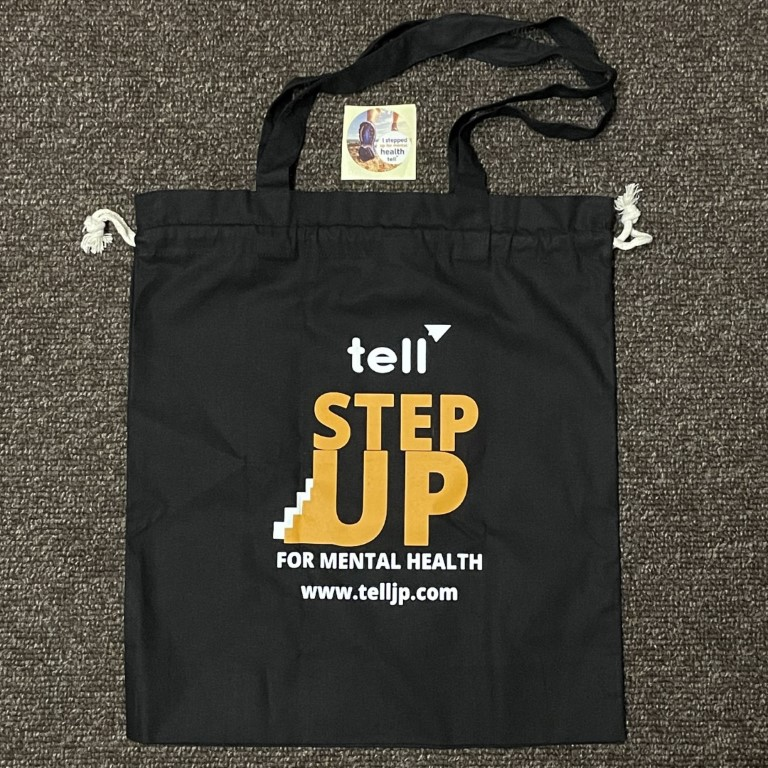
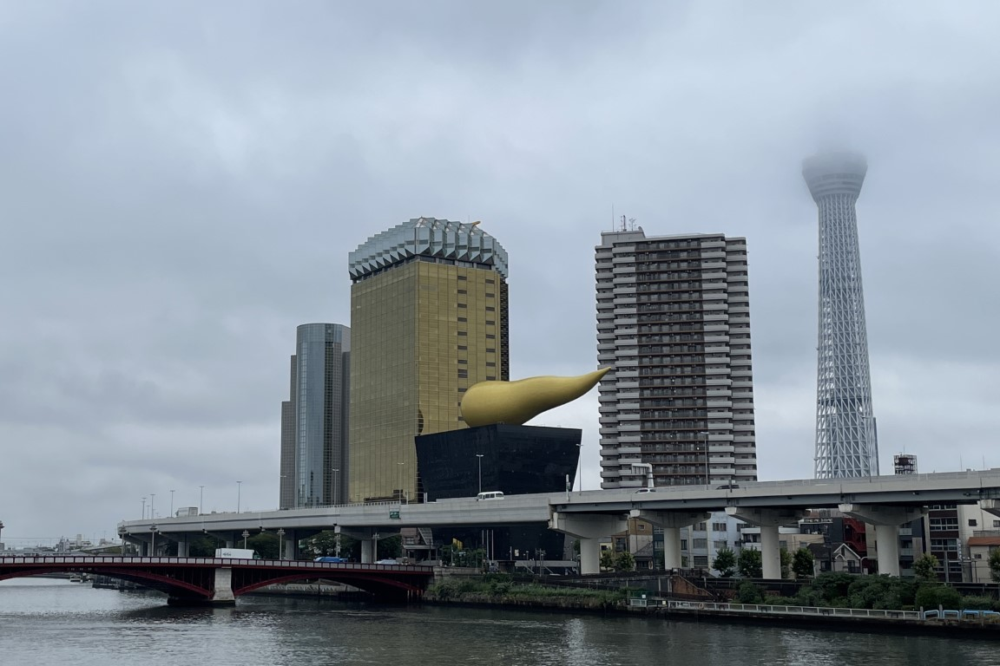

# Recap of the 2022 TELL 21,007 Step Up Challenge

This year, I participated in the Step Up Challenge by [TELL Japan](https://telljp.com/), which is an event to honor the people who lost their lives to suicide in Japan in 2021. The purpose of this event is to raise mental-health awareness and funds for TELL to continue providing lifesaving services to the English-speaking community in Japan. Although you can participate in the event solo or as a group, I decided to join as an individual.

By registering for the event, you may be eligible to receive event goodies (while supplies last!). This year's goodie bag included a nice tote bag, which was perfect for holding my water bottle, phone, wallet, keys, and any groceries I bought during my walks.

<figure markdown>
  
  <figcaption>2023 TELL Step Up Challenge swag: tote bag and sticker</figcaption>
</figure>

For details about the Step Up Challenge and other events, see [TELL Japan events](https://www.tellevents.org/).

## Why I'm taking part in the 2022 Step Up Challenge

I heard about TELL on Twitter a few years ago, but I didn't know about this event until I read about it on the ["TELL 21,081 Steps" blog post on nanikore.net](https://www.nanikore.net/2021/10/11/tell-21081-steps/).
 
Living in Japan can get rough for nonnative residents. I had heard about how many foreigners struggle with how to proceed after around five years because of being homesick, wanting a better job, or other factors. I experienced a similar situation around my five-year anniversary mark. If I knew about TELL at that time, I believe I would have gotten the support that I needed and potentially saved quite a lot of yen on questionably helpful self-help books.

## How I participated in the 2022 Step Up Challenge

To honor the 21,007 people who lost their lives to suicide in 2021, I walked 21,007+ steps around Tokyo on the following dates.

??? success "September 10, 2022 - 21,034 steps"

    .jpg)

??? success "**September 17, 2022** - 22,197 steps"

    .jpg)

??? success "**October 10, 2022** - ##,### steps"

    In progress...

Next year, I want to have some other activities lined up besides walking, like:

- Writing blog posts that total X number of words,
- Reading for X seconds of yoga within the event period, and/or
- Create a playlist that includes X seconds of easy-listening music to relax to.

## Wrap up

<figure markdown>
  
  <figcaption>A view of the Asahi Beer Hall and Tokyo SkyTree on my walk from October 10, 2022</figcaption>
</figure>

I'll definitely participate in this event in the future and continue to promote TELL's support services to English speakers. Now that I know a bit more about how the event works, I'll also consider participating with a small group next time.

For English speakers living in Japan who are struggling and need someone to talk to, I recommend contacting TELL through their [Lifeline service](https://telljp.com/lifeline/). The organization's website also regularly posts on their blog and offers a lot of resources if you prefer to get help at your own pace our outside of support hours.

We all struggle at some point, so I highly recommend keeping TELL top of mind if you find yourself going through a difficult time.
