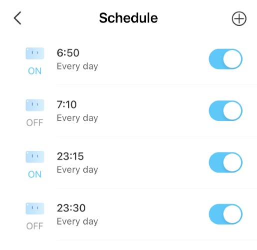
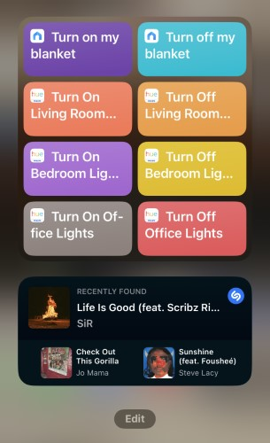

# Adding smart capabilities to my heated blanket

Every autumn and winter, I avoid turning on the HVAC units and space heaters in my apartment until absolutely necessary. The reason I wait is because those units:

- Are not energy efficient, which causes environmental waste and a higher electricity bill.
- Dry out the air, which causes dry mouth, dry nostrils, and dry eyes.
- My spouse and I have different thresholds for bedroom temperature.

To address these concerns, I decided to buy a heated blanket and make it "smart."

<!-- more -->

!!! info
	
	**Disclosure:** Some of the links in this post are affiliate links. If you go through those links to make a purchase, I may earn a commission. Note that I only link to products and services if I am actively using them and am greatly satisfied with my experience.

## Hopping on the heated-blanket bandwagon

To avoid having to use the HVAC units or space heaters, I purchased a [heated throw blanket from Amazon Japan](https://amzn.to/3U3lsU6). If you're in the US, [Amazon US also sells a wide selection of heated blankets](https://amzn.to/3Fm7IzL).

I chose a heated **_throw_** blanket, which is thinner than a standard blanket, because:

- I wanted a blanket that I could either lie on as a bed mat or drape over me while I sleep.
- I planned to used another, slightly thicker blanket while I slept.
- I wanted a blanket to use in the living room or home office.

## Making my heated blanket smart

Never to miss a chance to automate even the most basic tasks, I purchased a [TP-Link Tapo smart plug on Amazon Japan](https://amzn.to/3TI6B1P) to create a smart heated blanket. If you're in the US, [Amazon US also sells the Tapo smart plug](https://amzn.to/3U4MJWb).

The Tapo smart plug is an IoT device that enables you to control devices remotely. In this case, I can control the smart plug from the TP-Link Tapo app.

!!! note

	Since the remote control for adjusting the temperature of the blanket is analog, I can't adjust the temperature automatically. However, I can still manually adjust the temperature on the remote control.

After connecting the Tapo smart plug to my Wi-Fi network, I configured the Tapo app to:

- Turn on the plug before I go to sleep, and turn it off after 30 minutes.
- Turn on the plug 10 minutes before my alarm goes off, and turn it off 10 minutes after my alarm goes off.

By setting these schedules, I accomplish the following:

- Getting into a warm bed without the feeling of cold bed sheets
- Holding myself accountable for going to bed on time
- Waking up in a warm bed
- Holding myself accountable for not lounging around in bed

In the future, I might consider adding on/off intervals to ensure I stay warm throughout the night.

<figure markdown>
  
  <figcaption>Screenshot of my schedule in the TP Link Tapo app</figcaption>
</figure>

I also configured the Tapo smart plug through the Shortcuts app in iOS. This allows me to press a button in the Shortcuts widget to turn my blanket on or off. In the future, I'll look in to being able to turn my heated blanket on or off by using Alexa or Siri.

<figure markdown>
  
  <figcaption>Screenshot of my Shortcut widgets screen</figcaption>
</figure>

## Ready for winter!

So far, my smart heated throw blanket has been a great addition to my cold-weather arsenal. Aside from using the blanket when sleeping, I underestimated draping the blanket over my lap while working in my home office. Overall, I highly recommend getting a heated blanket and making it smart to make sleeping during autumn and winter a bit more relaxing.

I have one more Tapo smart plug left, so I might use it to automate the lights for my Christmas tree.🎄
