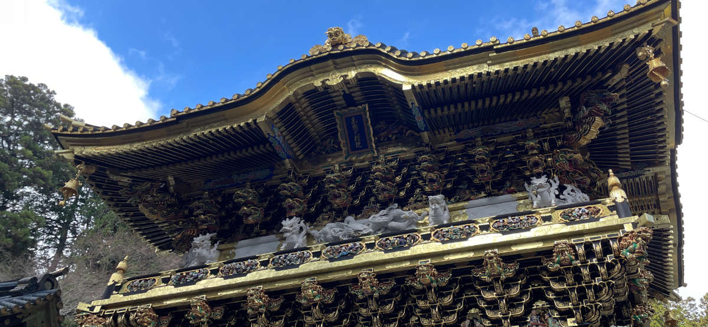
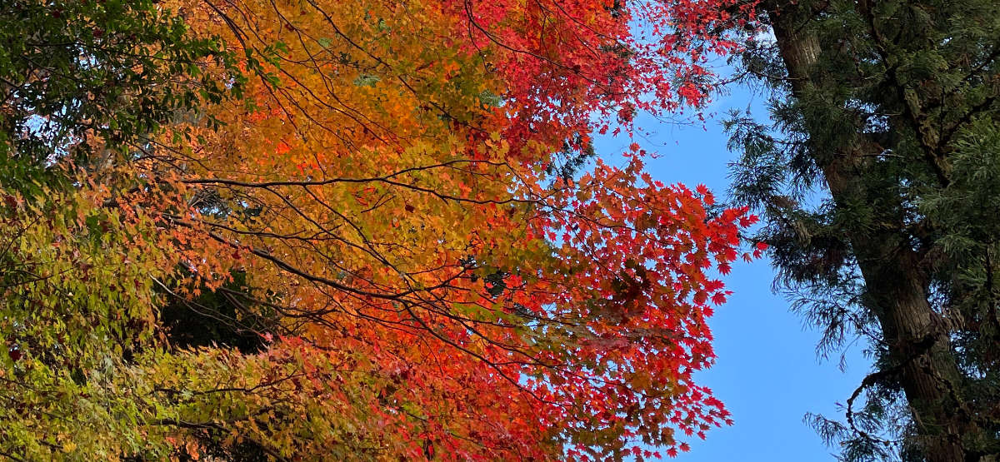

# Month in review - November

This month-in-review post is a digest of topics that I don't cover in dedicated blog posts.

- Aunt and uncle visited Tokyo
- Configured a custom domain

<!-- more -->

## Aunt and uncle visited Tokyo

For the first time since December 2019, I saw family in person! Coincidentally, my aunt and uncle who visited this November were the last relatives I saw in person in December 2019.

We had a heckuva two weeks, going to various places and trying out some new food spots. To get away from Tokyo for a bit, we went to a couple spots: Nikko and Kamakura.

### Short trip to Nikko

Nikko is an amazing spot to check out in the fall when the leaves change color. We got the about a week after peak leaf-changing season, but the sights of the foliage was still perfect.

<figure markdown>
  
  <figcaption>A gate inside of Toshogu</figcaption>
</figure>

 As we strolled around the area, which is serene yet a two-hour ride from Tokyo, I could envision myself living there when I want some peace and quiet.

<figure markdown>
  
  <figcaption>Mid-color foliage changing</figcaption>
</figure>

### Day trip to Kamakura

I forget how close Kamakura is to Tokyo. My aunt wanted to visit Kamakura, so I happily obliged and took another day off work to show her and my uncle around.

I hadn't been to the giant Buddha statue in at least 16 years, so visiting the area again was a nice stroll down memory lane.

<figure markdown>
  
  <figcaption>Gate outside of Toshogu shrine</figcaption>
</figure>

## Configured a custom domain

I bought a domain and am actually using it! Below is my reason for choosing this particular domain, which is also currently on my [About](../about) page:

> I like the hex color [**#080f53**](https://encycolorpedia.com/080f53), which is dark blue-violet.
> 
> Also, finding unique domain names is hard😅

After I configured GitHub Pages to use [080f53.com](https://www.080f53.com), I restructured the site to focus on my blog. I’ve got some more tweaking to do, but I'll apply those minor changes as time permits.