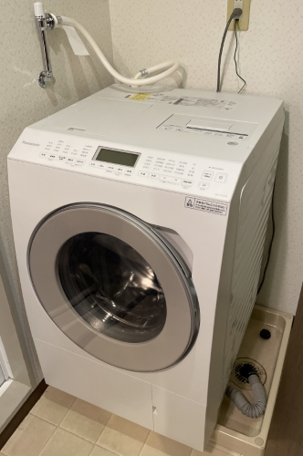
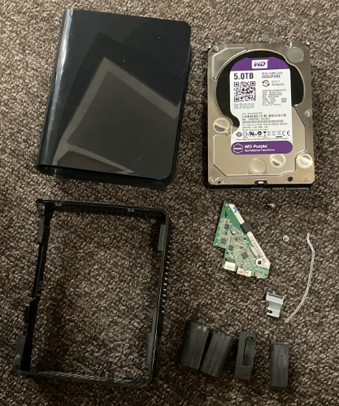

# Month in review - December

December is always a bit of a hectic month with holiday gatherings and wrapping up tasks at work before the New Year break. Although I didn't get around to writing a post for this month, I do have quite a few topics to briefly share in this month-in-review post.

- Wrote a post for the Mercari Engineering Blog
- Bought a washer and dryer machine
- Tried resurrecting a problematic hard drive

<!-- more -->

!!! info

    **Disclosure:** Some of the links in this post are affiliate links. If you go through those links to make a purchase, I may earn a commission. Note that I only link to products and services if I am actively using them and am greatly satisfied with my experience.

## Wrote a post for the Mercari Engineering Blog

As part of the annual Advent Calendar series of posts on the [Mercari Engineering Blog](https://engineering.mercari.com/en/blog/), I wrote about personal knowledge management (PKM):

- [Capturing and applying knowledge through a personal knowledge management practice](https://engineering.mercari.com/en/blog/entry/20221202-capturing-and-applying-knowledge-through-a-pkm-practice/)

Let me know what you think!

## Bought a washer and dryer machine

Hang clothes outside or inside to dry is pretty common Japan. But sometimes, we need to wait a full day (or two!) for clothing like jeans and hooded sweatshirts to completely dry.

After researching machines and confirming that one would fit, my wife and I decided to buy a [Panasonic NA-LX127BL-W (Japanese)](https://hb.afl.rakuten.co.jp/ichiba/2e8bd7b9.a36d0b3a.2e8bd7ba.af228498/_RTLink64352?pc=https%3A%2F%2Fitem.rakuten.co.jp%2Fbiccamera%2F4549980677285%2F&link_type=hybrid_url&ut=eyJwYWdlIjoiaXRlbSIsInR5cGUiOiJoeWJyaWRfdXJsIiwic2l6ZSI6IjI0MHgyNDAiLCJuYW0iOjEsIm5hbXAiOiJyaWdodCIsImNvbSI6MSwiY29tcCI6ImRvd24iLCJwcmljZSI6MCwiYm9yIjoxLCJjb2wiOjEsImJidG4iOjEsInByb2QiOjAsImFtcCI6ZmFsc2V9). This front-loading, drum-type machine uses a heat-pump system for drying, which dries clothes pretty darn quick. The machine has a smartphone function that is convenient for:

- Scheduling a washing and drying cycle.
- Checking the soap and softener tanks.
- Confirming details about errors that occur during a washing cycle.

<figure markdown>
  
  <figcaption>Panasonic NA-LX127BL-W washer and dryer  machine after installation</figcaption>
</figure>

Overall, we're very happy with the Panasonic NA-LX127BL-W washer and dryer machine. We've reduced how much time we spend hanging clothes out to dry and saved a lot of time waiting for those clothes to dry. Our clothes also smell much more pleasant and feel a lot softer!

## Tried resurrecting a problematic hard drive

A friend told me that his computer refused to recognize his external hard drive. On top of that, the hard drive made a clicking sound. I offered to troubleshoot the issue on my computer.

I tried the following methods to salvage the problematic hard drive:

| **Method** | **Result** |
| ----------- | ----------- |
| **Plugged the hard drive into my desktop and then my laptop** | No change. Both computers exhibited the same behavior of briefly showing a connection to the hard drive but neither were able to show the contents of the hard drive. After a while, both computers were eventually unable to connect to the hard drive, which caused an endless loop of the computer trying to install the device driver. |
| **Uninstalled the driver when Device Manager finds the device, then restarted my computer** | No change. The drive still didn't appear in the list of available drives. |
| **Installed WD Drive Utilities to see if the hard drive appeared in the utilities software** | The drive does appear in this tool even after restarting the computer and unplugging and plugging in the device again. |
| **Followed the steps in [How to Shuck a WD Elements External Hard Drive](https://www.ifixit.com/Guide/How+to+Shuck+a+WD+Elements+External+Hard+Drive/137646) to open the external casing of the hard drive to check if there were any loose parts** | Nothing seemed loose. I made sure all the connectors were fully connected, but the drive still didn't appear in the list of available drives. Unfortunately, I lack the tools to open the disk enclosure and inspect the issue further. |
| **Followed the steps in [How to Shuck a WD Elements External Hard Drive](https://www.ifixit.com/Guide/How+to+Shuck+a+WD+Elements+External+Hard+Drive/137646) to cover the 3.3V pin with tape.** | Covering the 3.3V pin with tape didn't work. The drive still didn't appear in the list of available drives. |

<figure markdown>
  
  <figcaption>Friend's disassembled Western Digital Elements  external hard drive</figcaption>
</figure>

Unfortunately, I was out of ideas to resolve the connection to the faulty hard drive. At this point, the only way to copy the data on the hard drive is to contact a professional who could remove the disk from its enclosure and further troubleshoot the issue.
